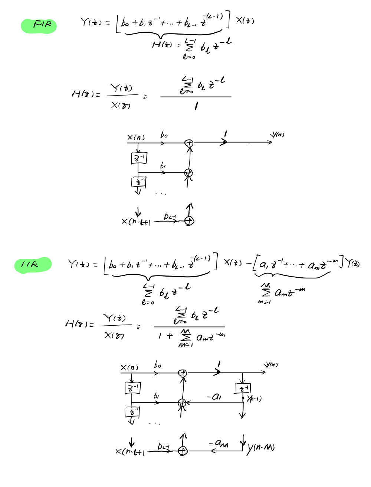

<head>
    
    
</head>

> **This is a note about Realtime DSP**  
> **Reference: 《实时数字信号处理 实践方法与应用 第二版》**

# 1. 从模拟信号到数字信号

## 1.1 模数转换

我们用计算机处理的是数字信号，需要将模拟信号先转换到数字信号（模数转换ADC)  
ADC的过程就是采样，量化，编码，其中：

- **采样定理：**

    用周期冲击函数（周期 $T$）从连续信号采样，频域上是频谱的周期延拓，频率是 $\Omega_s=\frac{2\pi}{T}$, 采样频率 $F_s=\frac{1}{\Omega_s}$
**奈奎斯特定律**：采样频率大于两倍信号最高频率 $F_s > 2 f_h$,否则会频谱混叠
- **抗混叠滤波器：**
采样定理的前提是信号带限，有最高频率。但是在实际应用，模拟信号可能在感兴趣的最高频率之外还有很大能力，或者有宽带噪声，这时候一般采样率都是预先固定的。比如采样率8k的语音系统，实际语音的频率分量可能不止4k，为了满足采样定理，我们需要先滤掉高于4k的频率（用抗混叠滤波器）
实际中，一般用带通滤波器，不仅滤波高于奈奎斯特频率的分量，也要滤除直流偏移和其它低频分量。
进一步的，数字滤波器不是理想的模拟滤波器，不能完全达到滤波效果；即使是模拟滤波器，可能也会引入相位失真；但是对于高采样率系统，还是会用最小相位失真的简单低功耗反混叠滤波器
最小相位失真又怎么实现？（待补充）
- **量化：**
离散数字信号幅度的强度就是（编码为）具有B个字节表示的二进制数字 $x(n)$
  - 将采样的幅度量化为 $2^B$ 个量化电平之一
  - 如果 $x(n)$ 刚好在两个量化电平之间，会做一个近似，这就会引入量化误差/噪
  - 量化噪声不超过量化间隔，量化位数越多，量化间隔越小，量化噪声越小
- **数模转换(DAC):** 从量化电平重建模拟波形，一般会用低通滤波器使得阶梯状的模拟信号变平滑，如果高精度重建波形又是一个问题，不讨论。

## 1.2 DSP硬件简单了解

基本有五种硬件平台：

- 专用的芯片/集成电路（ASIC）
- FPGA
- 通用的微处理器/控制器：$\mu P / \mu C$
- 通用的DSP（数字信号处理器）：高速度、较好的能量效率和较低成本
- 特定硬件加速的DSP

DSP处理器可以分为定点和浮点

DSP有实时约束，要求信号处理加上IO开销的时间t小于一个采样周期T，因此限制了可以处理的最高频率，处理时间越长，可处理的带宽越低；虽然新的科技和优化不断推出，但是性能和成本还是有trade-off

## 1.3 数字音频基本常识

[https://www.jianshu.com/p/638fa13082eb?utm_campaign=maleskine](https://www.jianshu.com/p/638fa13082eb?utm_campaign=maleskine)

- **采样率**
模拟信号向数字信号转换过程中，数字转换设备每秒采集到的数量，单位为Hz
8kHz, 就是每秒8000个采样点
- **采样位数**
将采样的样本幅度进行量化，用多少个bit进行存储，比如16bit和24bit
也可以称为声卡的分辨率，数值越大，精度越高
- **比特率** 
48kHz, 24bit 的立体声（2 channel），比特率48*24*2 = 2304 kbps
- **动态范围：**
描述放大器在最大不失真的情况下，输入信号和放大器本底噪声信号的比（有一个复杂的计算公式）1bit深度的动态范围的增量是6dB
同一个音频工程导出同格式，24bit音频比16bit音频在动态上是高的
- WAV格式：
上面说的概念可能指的是PCM数据，是一个裸码流，由声道、采样位数、采样率和时长决定，如果你预先不知道这些信息，就无法提取正确提取音频
常见的WAV格式则是在PCM开头用额外44字节表征了以上的元信息

# 2 时频分析：

## 2.1 信号与系统基础

### 2.1.1 数字信号

之前提到，数字信号是用周期冲击函数（周期 $T_s$,采样频率 $f_s$）从连续信号采样，频域上是频谱的周期延拓

模拟信号:  $x(t)=Asin(\Omega t+\phi)=Asin(2\pi ft+\phi)$

数字信号:  $x(n)=Asin(\Omega nT_s+\phi)=Asin(2\pi fnT_s+\phi)$

数字信号的 数字角频率： $\Omega_s=\Omega T_s=\frac{2\pi f}{f_s}$，
假设 $f_s=8k, f=1k$，表示对0到 $2\pi $一个周期采样8个点， $\pi $对应了被采信号的最高频率
采样间隔： $T_s=\frac{1}{f_s}$

归一化数字角频率： $F=\frac{\Omega_s}{\pi}=\frac{2 f}{f_s}$,最大值为1

### 2.1.2 Z变换

#### 应用

用来分析离散时间系统
用来创建改进后的滤波器，比如级联和并联多系统
得到滤波器的传输函数，然后获得结构图

